# Session Overview — Single Source of Truth

**Version**: 1.0  
**Last Updated**: December 28, 2025  
**Status**: Single Source of Truth for all session information

This document is the **authoritative reference** for session roadmap, status, and details. All other documentation should reference this file rather than duplicating session information.

---

## Session Roadmap

The learning journey progresses through **focused sessions**, each building on previous concepts and producing a concrete artifact aligned with GitHub Foundations Certification exam domains. The number of sessions is flexible and can expand as needed to comprehensively cover all exam domains.

### Session Progression

```mermaid
graph LR
    S1["01️⃣ Git & GitHub Intro<br/><small>Version Control Basics</small>"]
    --> S2["02️⃣ Teams & Collaboration<br/><small>Workflows & Management</small>"]
    --> S3["03️⃣ Branching & Merging<br/><small>Repository Operations</small>"]
    --> S4["04️⃣ Pull Requests<br/><small>Code Reviews</small>"]
    --> S5["05️⃣ GitHub Actions<br/><small>Automation & CI/CD</small>"]
    --> S6["06️⃣ GitHub Pages<br/><small>Publishing & Deployment</small>"]
    --> S7["07️⃣ Security & Best Practices<br/><small>Protection & Secrets</small>"]
    --> S8["08️⃣ Open Source<br/><small>Community & OSS</small>"]

    style S1 fill:#E3F2FD,stroke:#64B5F6,stroke-width:2px,color:#0D47A1
    style S8 fill:#E8F5E9,stroke:#66BB6A,stroke-width:2px,color:#1B5E20
```

---

## Session Details Table

| Session | Topic | Deliverable | Focus Area | Exam Domain | Type | Status | Duration |
| ------- | ----- | ----------- | ---------- | ----------- | ---- | ------ | -------- |
| **01** | Introduction to Git and GitHub | Git basics cheat sheet + first repository notes | Version control fundamentals | GitHub Basics | 📚 Knowledge | 🔄 Draft | 60 min |
| **02** | GitHub for Teams: Practical Management & Collaboration | Team workflow diagram + repository settings checklist | Collaborative workflows | Collaboration | 📚 Knowledge | 🔄 Draft | 60 min |
| **03** | Working with Repositories: Branching and Merging | Branching strategy guide + merge conflict resolution notes | Branching, commits, merges | Working with Repositories | 🛠️ Practice | 📋 Planned | 60 min |
| **04** | Pull Requests and Code Reviews | PR workflow diagram + code review checklist | PR workflow, reviews | Collaboration | 🛠️ Practice | 📋 Planned | 60 min |
| **05** | GitHub Actions and Automation | Basic workflow example + automation decision tree | Workflows, CI/CD basics | GitHub Tools | 🛠️ Practice | 📋 Planned | 60 min |
| **06** | GitHub Pages and Publishing | Pages deployment guide + publishing checklist | Static site hosting | GitHub Tools | 🛠️ Practice | 📋 Planned | 60 min |
| **07** | Security and Best Practices | Security checklist + branch protection guide | Permissions, protection, secrets | Security & Best Practices | 📚 Knowledge | 📋 Planned | 60 min |
| **08** | Open Source and Community | OSS contribution guide + license decision tree | Licenses, OSS workflows | Open Source & Community | 📚 Knowledge | 📋 Planned | 60 min |

**Legend**:

- ✅ **Complete** - Ready for use
- 🔄 **Draft** - In progress, needs completion
- 📋 **Planned** - Not yet started

---

## Learning Flow

**Foundation Sessions (1-2)**: Build Git/GitHub fundamentals and understand collaboration  
**Practice Sessions (3-4)**: Master repository operations and pull request workflows  
**Tools Sessions (5-6)**: Automate with Actions and publish with Pages  
**Advanced Sessions (7-8)**: Secure repositories and contribute to open source

**Total Duration**: Varies based on number of sessions (typically 60 minutes per session)

---

## Session Content Locations

**All learning content is organized in `src/` by exam domains** - this is the single source of truth.

| Session | Content Location (src/) | Session Overview (docs/sessions/) |
|---------|------------------------|-----------------------------------|
| **01** | `src/01_github-basics/` | *Optional* |
| **02** | `src/03_collaboration/` | *Optional* |
| **03** | `src/02_working-with-repositories/` | *Optional* |
| **04** | `src/03_collaboration/` | *Optional* |
| **05** | `src/04_github-tools/` | *Optional* |
| **06** | `src/04_github-tools/` | *Optional* |
| **07** | `src/05_security-and-best-practices/` | *Optional* |
| **08** | `src/06_open-source-and-community/` | *Optional* |
| **09+** | `src/` (by exam domain) | *Optional* |

**Note**: `docs/sessions/` is kept minimal - it contains session metadata and overviews that link to `src/` content. The actual learning content lives in `src/` organized by exam domains.

---

## Session Prerequisites

| Session | Prerequisites | Enables | Exam Domain Mapping |
|---------|---------------|---------|---------------------|
| **01** | None (starting point) | Session 02 | GitHub Basics |
| **02** | Session 01 | Session 03, 04 | Collaboration |
| **03** | Session 02 | Session 04 | Working with Repositories |
| **04** | Session 03 | Session 05 | Collaboration |
| **05** | Session 04 | Session 06 | GitHub Tools |
| **06** | Session 05 | Session 07 | GitHub Tools |
| **07** | Session 06 | Session 08 | Security & Best Practices |
| **08** | Session 07 | Additional sessions as needed | Open Source & Community |
| **09+** | Previous sessions | Additional sessions as needed | Various domains |

---

## Exam Domain Coverage

| Exam Domain | Sessions Covering | Status |
|-------------|-------------------|--------|
| **GitHub Basics** | Session 01 | 🔄 Draft |
| **Working with Repositories** | Sessions 01, 03 | 📋 Planned |
| **Collaboration** | Sessions 02, 04 | 🔄 Draft / 📋 Planned |
| **GitHub Tools** | Sessions 05, 06 | 📋 Planned |
| **Security & Best Practices** | Session 07 | 📋 Planned |
| **Open Source & Community** | Session 08 | 📋 Planned |

---

## Maintenance

**When to Update This File**:

- Session status changes (Draft → Complete)
- New sessions are added
- Session details change (topic, deliverable, duration)
- Prerequisites or enables relationships change
- Exam domain mappings change

**After Updating**:

- Update session status in table
- Verify all file paths are correct
- Test all links
- Update related documentation

---

## Related Documentation

- **Master Plan**: [`02_master-plan.md`](02_master-plan.md) - Complete learning roadmap and principles
- **Repository Structure**: [`01_repository-structure.md`](01_repository-structure.md) - Single source of truth for structure
- **Session Template**: [`templates/session-template.md`](templates/session-template.md) - Standard session format (if exists)
- **Main README**: [`../README.md`](../README.md) - Repository entry point

---

**Note**: This file serves as the **single source of truth** for session overview information. All other documentation should reference this file rather than duplicating session details.